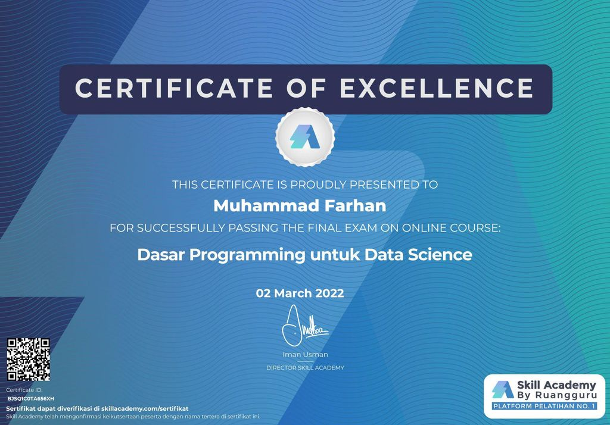

  

 

<h1 align="center">Skill Academy - Basic Programming for Data Science</h1>

  Repositori ini berisi tentang hasil pembelajaran saya selama mengikuti course <strong>Basic Programming for Data Science</strong> dari <strong>Skill Academy</strong>.

  Source Data : 

<a> <strong>Skill Academy</strong> </a>

  Editor :

  
  

  Languages :

  
  
 

  Library :

    

 

Certificate of Excellence

  

  
